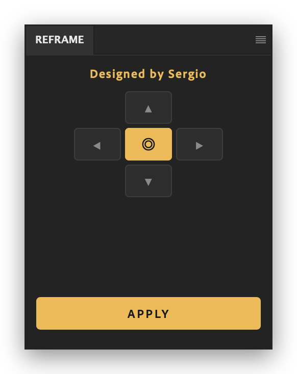
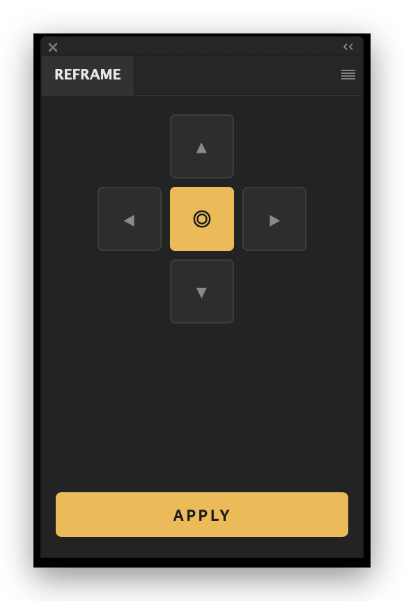
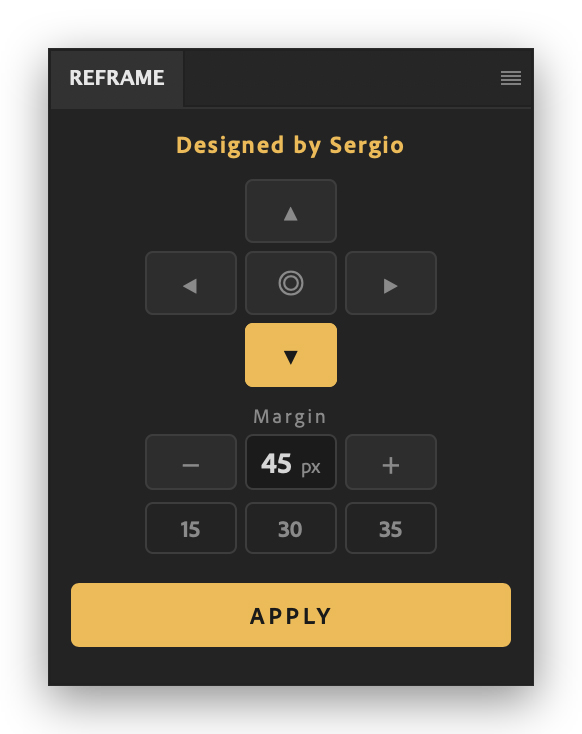

# R E F R A M E

**Non-destructive canvas reposition around `Path 1` — for Adobe Photoshop 2025 / 2026**

D e s i g n e d&nbsp;&nbsp;b y&nbsp;&nbsp;S e r g i o

 

 

<table>
<tr>
<td align="center"></td>
<td align="center"></td>
<td align="center"></td>
</tr>
<tr>
<td align="center">◎ Center · the panel folds away</td>
<td align="center">One saved preset · centered</td>
<td align="center">Side mode · full preset grid</td>
</tr>
</table>

 

## What it does

Repositions the canvas around **"Path 1"** with a single click. The canvas size always stays exactly **W × H** — the crop runs with `delete: false`, so pixels outside the canvas survive, and the whole operation lands in **one History step**.

## How it works

| | |
|---|---|
| **D-pad** | Pick the side the margin is measured from (▲ ▼ ◀ ▶), or **◎ Center** — the Margin block folds away entirely |
| **Value** | Shown dead-center as `45 px`. Click (or Tab) to type; **− / +** step by 5 |
| **Presets** | 3 slots, empty by default. **Right-click the value** — or **drag it down** — to save. Click to load, right-click to move / delete, drag to reorder. Duplicates are impossible |
| **APPLY** | Pinned to the bottom, always breathing. **Enter** applies from anywhere |

**Keyboard flow:** arrows pick the side → `Tab` lands in the field → type → `Enter` focuses APPLY → `Enter` applies. `C` = Center, `Esc` cancels an edit.

## Install

**The easy way** — grab `com.maestro.reframe_x.y.z.ccx` from [**Releases**](../../releases), double-click it, Creative Cloud does the rest. The panel appears under **Plugins → REFRAME by Maestro → REFRAME**.

Developer options (UXP Developer Tool / system plugins folder) — see [INSTALL.md](INSTALL.md).

## Engineering notes

The UI survives UXP's quirks by design: no native `<button>` (its internal layout truncates labels), no `flex-wrap`, no `gap`, no `calc()`, no stretched inputs — explicit flex rows on a single **3 × 46 px grid**, and an absolutely-positioned wrapper that keeps UXP's root scroller from reserving a scrollbar corner. Ported from the ExtendScript v1.1.0 original.

## License

**© 2026 Sergio (Maestro). All rights reserved.**

The source is published for review; copying, redistribution or commercial use requires the author's written permission — see [LICENSE](LICENSE).
